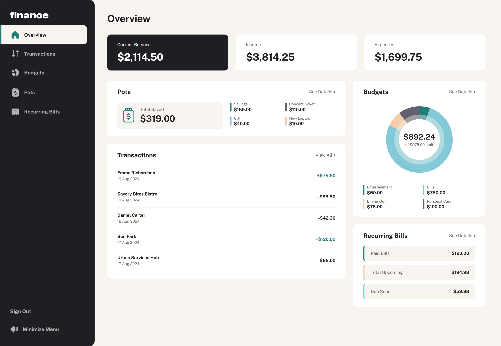

# Frontend Mentor - Personal finance app solution

This is a solution to the [Personal finance app challenge on Frontend Mentor](https://www.frontendmentor.io/challenges/personal-finance-app-JfjtZgyMt1). Frontend Mentor challenges help you improve your coding skills by building realistic projects.

## Table of contents

- [Overview](#overview)
  - [The challenge](#the-challenge)
  - [Screenshot](#screenshot)
  - [Links](#links)
- [My process](#my-process)
  - [Built with](#built-with)
  - [What I learned](#what-i-learned)
  - [AI Collaboration](#ai-collaboration)
- [Author](#author)

## Overview

### The challenge

Users should be able to:

- See all of the personal finance app data at-a-glance on the overview page
- View all transactions on the transactions page with pagination for every ten transactions
- Search, sort, and filter transactions
- Create, read, update, delete (CRUD) budgets and saving pots
- View the latest three transactions for each budget category created
- View progress towards each pot
- Add money to and withdraw money from pots
- View recurring bills and the status of each for the current month
- Search and sort recurring bills
- Receive validation messages if required form fields aren't completed
- Navigate the whole app and perform all actions using only their keyboard
- View the optimal layout for the interface depending on their device's screen size
- See hover and focus states for all interactive elements on the page
- **Bonus**: Save details to a database (built as a full-stack app with a Rails API)
- **Bonus**: Create an account and log in (JWT authentication with per-user data isolation)

### Screenshot



### Links

- Solution URL: [https://github.com/natashapl/personal-finance](https://github.com/natashapl/personal-finance)
- Live Site URL: [https://personal-finance-natashasworld.vercel.app](https://personal-finance-natashasworld.vercel.app)

## My process

### Built with

**Frontend**
- [Angular 21](https://angular.dev/) — standalone components, no NgModules
- Angular Signals for all state management (`signal()`, `computed()`, `effect()`)
- `ChangeDetectionStrategy.OnPush` throughout, with zoneless change detection (no Zone.js)
- Reactive Forms for form handling
- [Angular `NgOptimizedImage`](https://angular.dev/guide/image-optimization) for all static images
- CSS custom properties driven by the Figma design system
- Mobile-first responsive layout using CSS Grid and Flexbox
- Public Sans variable font with `rel="preload"`

**Backend**
- [Ruby on Rails 8.1](https://rubyonrails.org/) in API-only mode
- SQLite via Active Record
- Puma web server
- `bcrypt` for password hashing, `jwt` gem for token issuance
- `rack-cors` for cross-origin requests
- Per-user data scoping — all budgets, pots, and transactions belong to a user
- Demo account with read-only enforcement (`is_demo` flag + `require_non_demo!` guard)

**Testing**
- [Playwright](https://playwright.dev/) for end-to-end testing — 25 tests, all passing
- Tests cover: auth flows, budgets CRUD, pots CRUD (including add/withdraw money), transactions CRUD, search/filter, and pagination

**Quality**
- Lighthouse scores (desktop): 100 Accessibility · 100 Best Practices · 100 SEO · 100 Performance
- Lighthouse scores (mobile): 100 Accessibility · 100 Best Practices · 100 SEO · 94 Performance
- WCAG AA compliant: focus management, colour contrast, ARIA roles, keyboard navigation
- Custom `FocusTrapDirective` locks Tab/Shift+Tab inside modals and restores focus on close
- `aria-busy` on all page roots, `aria-live` loading announcements, `role="progressbar"` on savings bars

### What I learned

**Angular Signals + Zoneless**
Migrating to zoneless change detection (`provideZonelessChangeDetection()`, no `zone.js` import) gave a measurable Lighthouse performance improvement because Zone.js patches dozens of browser APIs at startup. Since signals already notify Angular when state changes, Zone.js adds overhead without any benefit in a fully signal-based app.

**JWT Auth in a SPA**
Storing the JWT in `localStorage` and attaching it via an HTTP interceptor keeps authentication simple without cookies or sessions. The interceptor pattern means no component ever touches the token directly:

```ts
export const authInterceptor: HttpInterceptorFn = (req, next) => {
  const token = inject(AuthService).token();
  return next(token ? req.clone({ setHeaders: { Authorization: `Bearer ${token}` } }) : req);
};
```

**Playwright strict mode pitfalls**
Two recurring issues when writing the E2E suite:

1. `getByRole('button', { name: 'Withdraw' })` matched _both_ the Withdraw action button and the ellipsis button whose `aria-label` was `"Options for Withdraw Pot"` — because Playwright's default is a case-insensitive substring match. Fix: `{ exact: true }`.

2. `getByLabel('Password')` matched both the password input and the show/hide toggle button (aria-label `"Show password"`). Fix: `{ exact: true }`.

**Multi-toast assertions in Playwright**
When two success toasts are visible simultaneously, `expect(locator).toContainText('x')` requires _all_ matched elements to contain the text — so a "Budget added" toast would cause the assertion for "Budget updated" to fail. Fix: `.filter({ hasText: '...' }).toBeVisible()` to scope to the specific toast.

### AI Collaboration

This project was built in collaboration with [Claude](https://claude.ai/) (Anthropic) using the Claude Code CLI.

**How AI was used:**
- Scaffolding the Rails API (models, controllers, auth, routing, CORS) and the Angular application structure from scratch
- Designing and implementing the accessibility layer (focus trap directive, ARIA attributes, live regions)
- Writing the full Playwright E2E test suite and iteratively debugging failures

**What worked well:**
Claude was effective at diagnosing issues as they came up, especially Playwright failures. Claude was also efficient at following instructions and requirements.

**What required iteration:**
Some Playwright fixes needed multiple rounds because the failure mode wasn't visible without running the tests. Providing the actual Playwright error output (including the page snapshot) dramatically sped up diagnosis compared to describing the failure in prose.

## Author

- Frontend Mentor - [@natashapl](https://www.frontendmentor.io/profile/natashapl)
